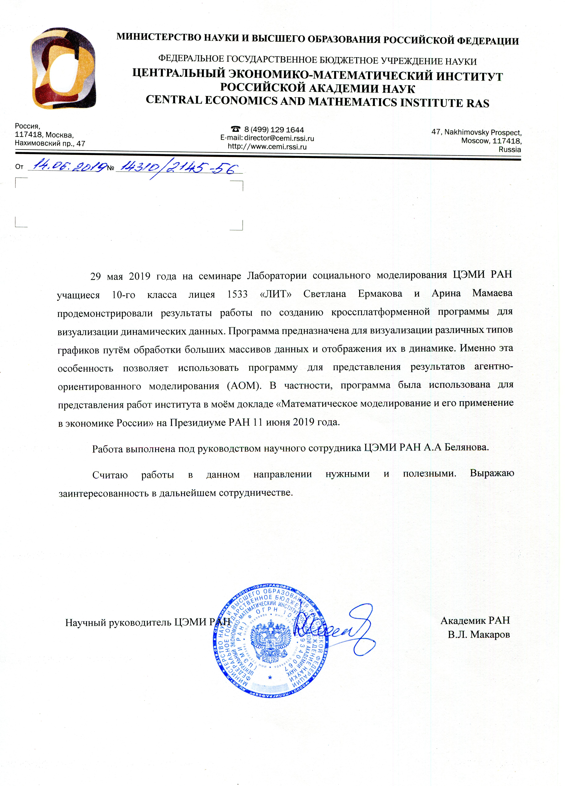

## Визуализация динамических данных
Визуализация усиливает восприятие и помогает проводить наглядный анализ данных с помощью средств инфографики Средства инфографики помимо изображений включают в себя графики, диаграммы, таблицы.
Без визуализации данных мы бы не смогли быстро и легко разбираться в таком огромном количестве данных, которые накапливаются сейчас каждый день. Ключевой идеей визуализации является поиск ответов на вопросы к данным в понятной и доступной форме. 

Информация в графическом виде привлекает большее внимания, легче воспринимается и помогает быстрее донести до аудитории ваше сообщение. С помощью наглядных графиков и «дашбордов»(вкладка для совмещения графиков) можно сделать понятными даже сложные наборы данных. Однако динамическая визуализация имеет еще больше преимуществ, так как позволяет наблюдать за изменениями в данных за выбранный конечный промежуток времени.
Изучив рынок, наш заказчик пришел к выводу, что на данный момент нет инструмента, совмещающего в себе визуализацию Динамических Данных, понятный интерфейс, разнообразие средств инфографики. Поэтому заказчик будет заинтересован в разработке нами такого инструмента.

Целевой аудиторией проектной работы так же являются любые учащиеся или научные сотрудники, которые нуждаются в анализе данных для своих работ и проектов. Поскольку визуализация активно используется в бизнесе, разработанное приложение будет полезно и представителям бизнеса.

По сути цель-некий универсальный инструмент для визуализации динамических данных. Который принимает на вход Excel-файл, обрабатывает данные, представляет их пользователю в виде различных таблиц, предоставляет большой выбор графиков и диаграмм, которыми можно проиллюстрировать данные таблицы, возможность комбинирования иразмещения графиков и диаграмм на одном экране-дашборде, возможность наблюдать за динамикой измененаполученных данных. 

Одним из требований заказчика было то, что приложение должно быть кросс-платформенным, для реализации этой задачи был выбран язык программирования Python ( согласно нашим исследованиям и информации заказчика именно на нем разработано большое количество бесплатных, богатых на возможности, библиотек. Кроме того, мы поняли, что это хороший обоснованный шанс освоить перспективный язык программирования.) 

Среда разработки - Microsoft Visual Studio 2017. Несмотря на то, что изначально мы хотели использовать IDLE -  базовую среду разработки программ для Python, спустя некоторое время мы решили вернуться к Visual Studio, так как хорошо освоили ее на уроках по специальности, а также в отличии от IDLE в нее интегрировано гораздо больше функций для реализации сложных проектов от этапа разработки до финального развертывания.

Анализ данных  выполнялся с помощью Pandas. Для создания графического интерфейса нашего приложения и визуализации данных с помощью графиков мы используем PySide - адаптацию кроссплатформенного фрэймворка (комплекса множества библиотек) Qt под язык Python. 

## Инструкция по установке:
1) Склонировать репозиторий
2) Активируйте venv и установите все зависимости из requirements.txt
3) заполните файлы Excel данными, которые хотите визуализировать
   
# Фидбэк о нашем проекте:

  

